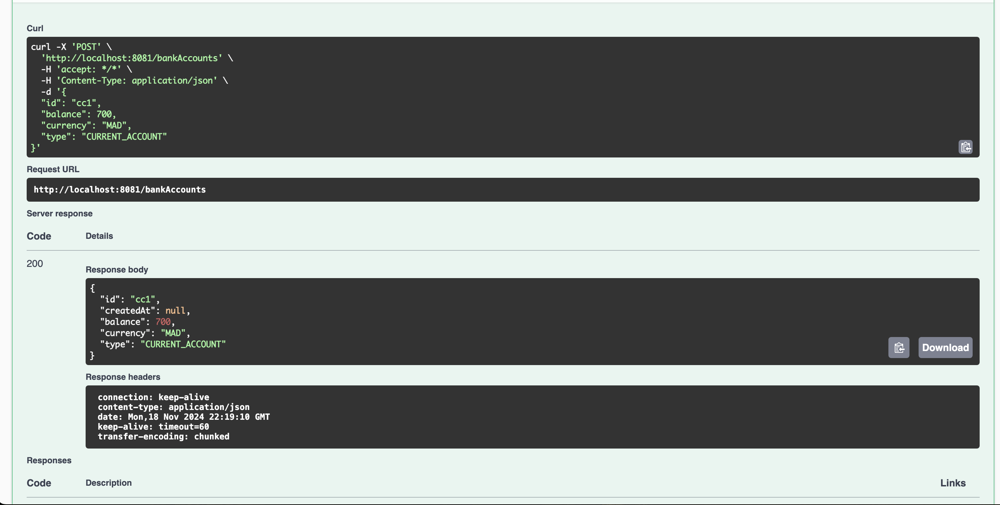
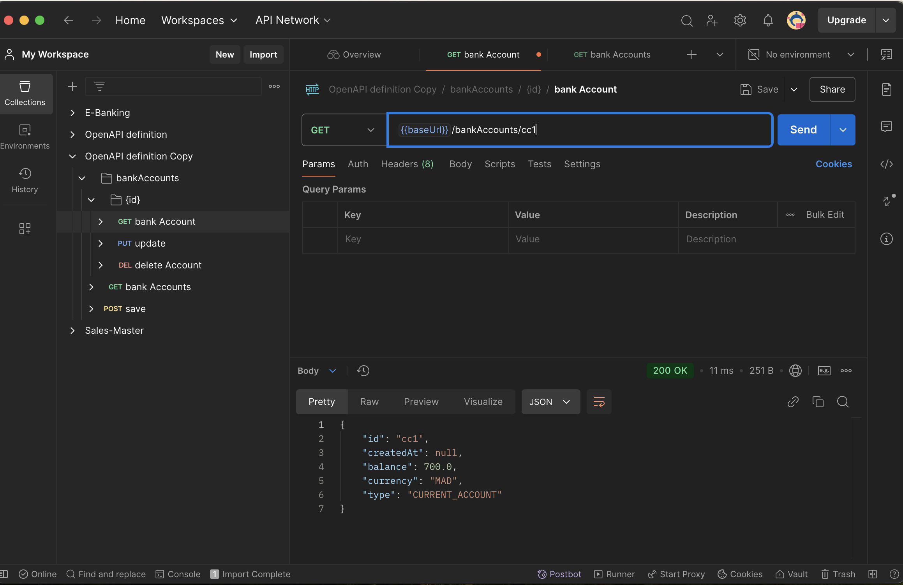
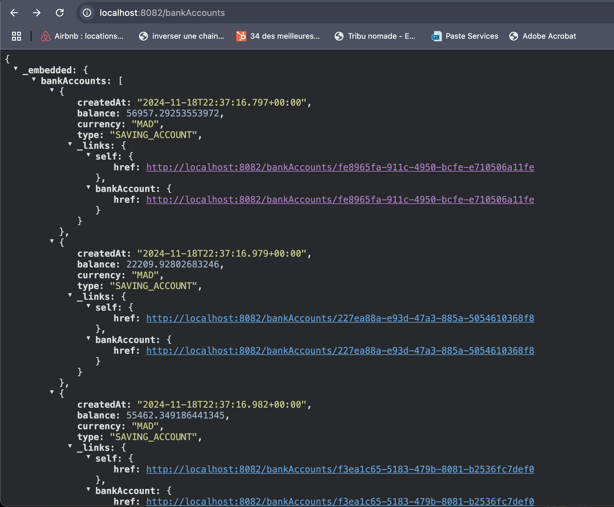

Générer et tester le documentation Swagger de des API Rest du Web service

Tester le web micro-service en utilisant un client REST comme Postman

Exposer une API Restful en utilisant Spring Data Rest en exploitant des projections

